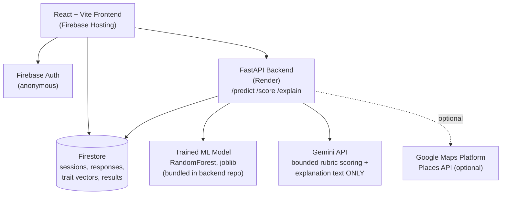

# Architecture — Rahbar Career Guidance Platform

> Authoritative technical spec for this repo. Companion documents: `PRD_Rahbar_Career_Guidance_Platform.docx` (product context) and `SRD_Rahbar_Career_Guidance_Platform.docx` (full requirements). This file is the condensed, machine-readable version an agent should read before writing code.

## 1. System overview

Rahbar collects behavioral and open-text responses through six in-app activities, computes a fixed-schema trait vector from them, uses a locally-trained classifier to rank career clusters, and uses Gemini for exactly two narrow, bounded tasks: scoring open-text responses against an explicit rubric, and converting the model's numeric output into natural-language explanation text.

## 2. Non-negotiable design principles

1. **The model decides, Gemini explains.** Gemini never receives raw, unscored response text alongside a decision-making role, and is never asked to choose or rank a career. If an implementation choice would blur this boundary, stop and ask before proceeding.
2. **No single deterministic verdict.** Always return 3–5 ranked career clusters with confidence, never one "correct answer."
3. **Data minimization.** Users are minors. Collect age band, not birthdate; no name required to use the product; no third-party data sharing.
4. **Graceful degradation.** Every Gemini call has a deterministic fallback. The core flow must never hard-fail on a third-party outage.
5. **Swappable scoring logic.** Activity-selection and career-matching logic must be isolated, single-purpose functions/endpoints so they can be upgraded later (see Section 9) without touching the rest of the system.

**Note on backend hosting:** this was originally scoped around Cloud Run; it now targets Render (or Railway/Fly.io) instead. Nothing about the architecture depends on GCP specifically — FastAPI is a plain container, Gemini is called over HTTPS from wherever the process runs, and Firestore is reachable from any backend via the Firebase Admin SDK. Swapping hosts later is a deployment-config change, not an architecture change.

## 3. Diagram



## 4. Tech stack

| Layer | Choice | Do not substitute without asking |
|---|---|---|
| Frontend | React + Vite + Tailwind CSS | ✓ |
| Interactions | Framer Motion (swipe/card animation) | |
| Charts | Recharts (trait radar chart) | |
| Backend | Python FastAPI on Render (or Railway/Fly.io — host-agnostic) | ✓ |
| Data | Firebase Firestore + Firebase Authentication (anonymous) | ✓ |
| ML | scikit-learn `RandomForestClassifier`, trained offline, served via `joblib` | |
| AI | Gemini API via the Google Gen AI SDK, called **server-side only** | ✓ |
| Hosting | Firebase Hosting (frontend), Render (backend) | |
| Optional | Google Maps Platform — Places API | may be dropped for time |

## 5. Component responsibilities

| Component | Responsibility |
|---|---|
| Frontend | Renders activities, captures responses, shows results. Writes to Firestore directly for low-latency UX. |
| Firebase Auth | Anonymous session identity; upgradeable to Google sign-in later. |
| Firestore | Sessions, raw responses, computed trait vectors, interpretation flags, recommendation results. |
| FastAPI backend | Hosts `/predict`, `/score`, `/explain`. The **only** component allowed to call Gemini or load the ML model. |
| ML model | Maps a trait vector to a ranked probability distribution over career clusters. |
| Gemini API | (a) bounded rubric scoring of open-text responses, (b) explanation-text generation from numeric results only. |
| Google Maps Platform | Surfaces nearby universities/institutes for the top-matched cluster. |

## 6. Data model (Firestore)

**`users/{userId}`** — `age`, `age_band` ("12-14"|"15-17"|"18-20"), `region`, `language` ("en"|"ur"), `created_at`

**`sessions/{sessionId}`** — `user_id`, `start_time`, `end_time`, `completion_status`, `activities_completed[]`

**`responses/{responseId}`** — `session_id`, `activity_id`, `raw_response`, `is_correct`, `latency_ms`, `attempt_number`, `rubric_scores` (Activities 3 & 5 only)

**`trait_vectors/{sessionId}`** — fixed-schema feature vector:
`R, I, A, S, E, C` (0–1, from Instinct Swipe) · `decisiveness` (Instinct Swipe) · `numerical_reasoning, logical_reasoning` (Pattern Hunter) · `data_interpretation, analytical_thinking` (Data Detective) · `creativity, flexibility, communication, originality` (Creative Problem Solver, via `/score`) · `risk_tolerance, decision_making, planning, leadership` (Decision Lab) · `domain_exposure` (Career Simulation, via `/score`) · plus `version`, `computed_at`

**`interpretations/{sessionId}`** — `flags[]` = `{type, field, note, source_activity}` · `confidence_modifier` (0.8–1.0)

**`recommendations/{sessionId}`** — `ranked_clusters[]` = `{cluster_id, confidence}` (top 5) · `explanation_text` (map, per cluster) · `model_version` · `generated_at`

**`careers`** (reference collection) — `cluster_id`, `title`, `riasec_vector`, `education_path`, `description`

## 7. The six activities

| # | Activity | Measures | Scoring |
|---|---|---|---|
| 0 | Instinct Swipe | RIASEC (R/I/A/S/E/C) + decisiveness | Deterministic — card tags + response time |
| 1 | Pattern Hunter | Numerical reasoning, logic, abstraction | Deterministic — correctness, latency, difficulty reached |
| 2 | Data Detective | Data interpretation, analytical thinking | Deterministic prediction + optional bounded-rubric reasoning text |
| 3 | Creative Problem Solver | Creativity, flexibility, communication, originality | Open text — `/score` bounded rubric |
| 4 | Decision Lab | Risk tolerance, decision-making, planning, leadership | Deterministic — pre-tagged scenario choices |
| 5 | Career Simulation | Domain exposure for the top predicted cluster | Open text/task — `/score` bounded rubric |

## 8. API contracts

### `POST /predict`
```json
// request
{ "trait_vector": { "R": 0.8, "I": 0.6, "...": "...", "domain_exposure": 0.4 } }

// response
{
  "ranked_clusters": [
    { "cluster_id": "software_engineering", "confidence": 0.71 },
    { "cluster_id": "data_science", "confidence": 0.19 }
  ],
  "model_version": "rf_v1"
}
```

### `POST /score`
```json
// request
{
  "activity_id": "creative_problem_solver",
  "response_text": "...",
  "rubric": ["creativity", "flexibility", "communication", "originality"]
}

// response — reject/retry once on invalid JSON, then fall back to a neutral 0.5 per dimension
{ "creativity": 0.7, "flexibility": 0.6, "communication": 0.8, "originality": 0.65 }
```

### `POST /explain`
```json
// request — numeric output ONLY, never raw response text
{
  "ranked_clusters": [{ "cluster_id": "software_engineering", "confidence": 0.71 }],
  "language": "en",
  "age_band": "15-17"
}

// response — on failure, fall back to a templated non-LLM string, do not block the flow
{ "explanations": { "software_engineering": "Your evidence points strongly toward Software Engineering..." } }
```

## 9. Algorithms

### 9.1 Adaptive next-activity selection (rule-based; keep isolated for a future bandit upgrade)
```python
def select_next_activity(confidence: dict, completed: set, catalog: list) -> str:
    remaining = [a for a in catalog if a.id not in completed]
    if not remaining:
        return None
    def gap_closed(activity):
        return sum(1 - confidence.get(skill, 0.0) for skill in activity.skills)
    return max(remaining, key=gap_closed).id
```

### 9.2 Interpretation engine
```python
def interpret(signals: dict) -> dict:
    flags = []
    if signals["I"] > 0.7 and signals["numerical_reasoning"] < 0.4:
        flags.append({"type": "unexplored_interest", "field": "Investigative",
                       "note": "High interest, low demonstrated aptitude — likely unexposed, not unsuited",
                       "source_activity": "instinct_swipe + pattern_hunter"})
    if signals.get("spatial", 0) > 0.75 and signals["R"] < 0.4:
        flags.append({"type": "hidden_strength", "field": "Realistic",
                       "note": "Strong mechanical/spatial aptitude with no stated interest — worth surfacing",
                       "source_activity": "pattern_hunter"})
    if signals["domain_exposure"] < 0.3 and signals["top_cluster_confidence"] > 0.7:
        flags.append({"type": "low_exposure",
                       "note": "Top match has minimal domain exposure — recommend beginner resources",
                       "source_activity": "career_simulation"})
    confidence_modifier = 1.0 if signals["decisiveness"] > 0.6 else 0.8
    return {"flags": flags, "confidence_modifier": confidence_modifier}
```

### 9.3 Career cluster prediction (train offline, serve via `/predict`)
```python
# train.py — run once in a notebook
from sklearn.ensemble import RandomForestClassifier
from sklearn.model_selection import train_test_split
import pandas as pd, joblib

df = pd.read_csv("riasec_career_dataset.csv")  # Open Psychometrics RIASEC dataset (~145k rows)
FEATURES = ["R","I","A","S","E","C","numerical_reasoning","analytical_thinking",
            "creativity","communication","risk_tolerance","domain_exposure"]
X, y = df[FEATURES], df["career_cluster"]
X_train, X_test, y_train, y_test = train_test_split(X, y, test_size=0.2, random_state=42)
clf = RandomForestClassifier(n_estimators=300, max_depth=12, random_state=42)
clf.fit(X_train, y_train)
print("Test accuracy:", clf.score(X_test, y_test))  # 70%+ is sufficient for the MVP demo
joblib.dump(clf, "career_model.joblib")
```
**Fallback if training data/time runs out:** cosine similarity between the trait vector and each career's `riasec_vector` in the `careers` collection, served behind the same `/predict` contract, so the rest of the system never needs to change.

## 10. Build phases

1. **Foundation** — scaffold frontend + backend, Firebase project, train the classifier, `/predict` live on Render.
2. **Deterministic activities** — Instinct Swipe, Pattern Hunter, Decision Lab; Firestore writes; results screen shell.
3. **Gemini-backed activities** — `/score` and `/explain` with fallbacks; Data Detective, Creative Problem Solver.
4. **Adaptive logic + polish** — activity selector, interpretation engine, Career Simulation, age-band skin toggle, offline resilience.

## 11. Acceptance criteria

- A fresh anonymous session can complete all 6 activities and reach a results screen with no manual intervention.
- Two sessions with deliberately different early answers get a different activity order.
- `/predict` returns 3–5 ranked clusters summing to ≤ 1.0 confidence.
- `/score` rejects/retries on non-JSON Gemini output, then falls back to a neutral score.
- `/explain` never receives raw response text — verify via request logging.
- Each interpretation flag type triggers correctly on a hand-built boundary-condition vector.
- Locally-queued activity responses survive a simulated network drop and sync once reconnected.

## 12. Explicitly out of scope for this build (do not implement without asking)

IRT-based ability estimation and item calibration · contextual-bandit activity selection · a learned/feedback-trained hybrid recommender · factor-analysis validation of the RIASEC structure · age-normed percentile scoring. These are Phase 2/3 roadmap items; the architecture above (isolated scoring functions, versioned trait vectors, a swappable `/predict` interface) is deliberately built so none of it requires a rewrite later.
